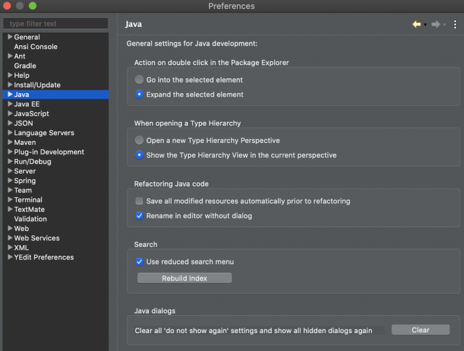
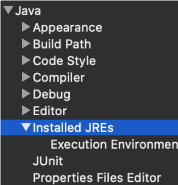
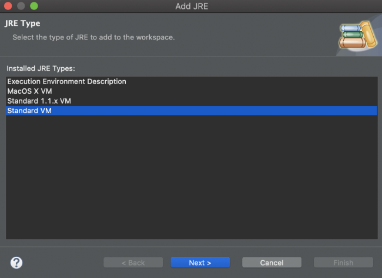
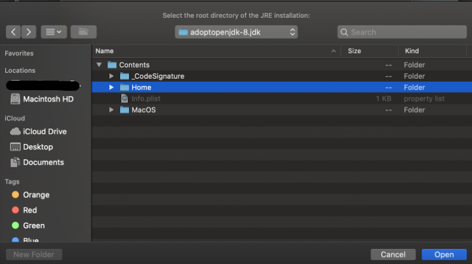
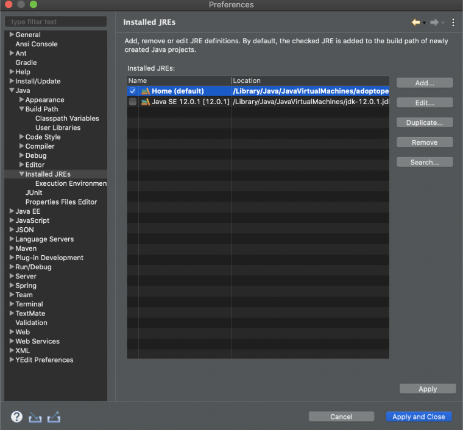

# Mac Java Environment Setup Guide

## Install Using A Package Manager

A *package manager* is a command line tool that allows you to install and manage software. You can use a package manager to install all of the software listed here.

The package manager that we'll be using for this guide is called Homebrew. It's a command-line installer for MacOS, which means that you'll have to be running a macOS in order to use. The examples provided here are utilizing macvscodeOS Catalina version 10.15.5.

## Step 1: Install Homebrew


Open your terminal and type <code>brew</code>.

The result should look like the following:


## Step 2: Install Git

With Homebrew installed, you are now ready to install Git. Open a terminal window and enter <code>brew install git</code>

To verify that Git is installed on your system, type <code>git --version</code>

## Step 3: Install JDK 8

Run the following commands in your terminal:
```code
brew untap adoptopenjdk/openjdk
brew untap caskroom/versions
brew cleanup
```

Once <code>cleanup</code> is finished, type the following command into the terminal:

<code>brew cask install adoptopenjdk/openjdk/adoptopenjdk8</code>


### Configure your Environment Variables
#### A. Mac OSX 10.5 or later:
In Mac OSX 10.5 or later, Apple recommends to set the <code>$JAVA_HOME</code> variable to <code>/usr/libexec/java_home</code>, just export <code>$JAVA_HOME</code> in file <code>~/. bash_profile</code> or ~<code>/.profile</code>.

```code
$ vim .bash_profile

export JAVA_HOME=$(/usr/libexec/java_home)

$ source .bash_profile

$ echo $JAVA_HOME
/Library/Java/JavaVirtualMachines/1.8.0.jdk/Contents/Home
```

#### B. Older Mac OSX:
For older Mac OSX, the <code>/usr/libexec/java_home</code> doesn’t exist, so, you should set <code>JAVA_HOME</code> to the fixed path:

```code
$ vim .bash_profile

export JAVA_HOME=/System/Library/Java/JavaVirtualMachines/1.8.0.jdk/Contents/Home

$ source .bash_profile

$ echo $JAVA_HOME
/System/Library/Java/JavaVirtualMachines/1.8.0.jdk/Contents/Home
```


## Step 4:  Install Spring Tool Suite 4

Navigate to https://spring.io/tools and download the appropriate version of Spring Tool.

If your installation was successful, you should now be able to search for <code>Spring Tool Suite</code> in your spotlight search using <code>cmd+space</code>.

Once downloaded, open Spring Tool and navigate to your preferences. 


1. Select **Java** in the left panel of your preferences and click on **Installed JREs**.








2. Click **add** on the right side of your preferences menu and select **Standard VM**.




3. Click the Directory button to navigate to your installed Java versions. 
    
    * When the finder window opens select your HD.
    * Select **Library** and look for **Java** listed below.
    * Click on **Java** and navigate into **JavaVirtualMachines** where you should see an <code>adoptopenjdk-8.jdk</code>.
    * Select this JDK and navigate to **Contents** and then **Home**.
    * With home highlighted, click **Open**. 



You should now see this:



## Step 5: Install DBeaver

Navigate to https://dbeaver.io/download/ and download the appropriate version of DBeaver.

If your installation was successful, you should now be able to search for "dbeaver" in your spotlight with <code>cmd + space</code>.

## Step 6: Install Postman

The following is the single command required to install Postman on macOS using Homebrew:

<code>brew cask install postman</code>

## Step 7: Install PostgreSQL

We will manually download the PostgreSQL installer visiting the official website. Look at the row for **version 10.13**.

Select the download link which corresponds with your system and click it.

You'll then be prompted to save the file. Click **Save File**. The file should now be located in your **Downloads** folder.

Double click the file, which should launch the installer. You might be asked if you want the application to make changes to your device. Click **yes**.

You'll be presented with several menus in the Setup Wizard.  Click <code>Next</code> until you get to the **Select Components** menu. 

Here, you'll want to select and/or deselect the following and then click <code>Next</code>:

Continue to click <code>Next</code> until you reach the **Password** menu. Here you will create a password for the default Postgres user (which is <code>postgres</code>). The password is completely up to you. That said, *DO NOT* forget your password as you won't be able to login to your database as the superuser.

After you've decided on a password, click <code>Next</code> on the remaining menus and allow time for Postgres to be installed. 

Once the installation is complete, you might be asked if you want to launch Stack Builder. You can say <code>no</code>.

PostgreSQL should now be successfully installed on your computer.


